# Live Link to [Fullstack](https://fullstack-network.herokuapp.com/)
### 1. Why / Background
  * Fullstack is a web based application that enable users, affiliated with coding boot camps, to organize their curriculum, and increase networking engagement.
 ### 2. What / Objectives / User Stories
  * From design through deployment of the application, this project used the following web development technologies:
    * Server-side: Node.js w/ Express web app framework; MySQL for data persistence w/ Sequelize ORM; Firebase DB for realtime data persistence; Passport for user authentication; WebSocket (TBD) for 2-way interactive communications across server/client 
    * Client-side: React.js library for component based user interface; Material Bootstrap framework for HTML/CSS
  * User Stories, by categorization:
    * Design and develop Wireframe mockup including conceptual single page application with component based views: login, user profile, pet profile, community
    * Design and develop Model schema including ORM (Sequelize) and DB (MySQL, Firebase) configuration
    * Design and develop View on UI including components (React)
    * Design and develop Controller functions including routing and required CRUD operations 
    * The JavaScript Glue PLACEHOLDER: split across team, and organize into actual user stories
 ### 3. How / Design Description
  * The scope of the project fits well into [Agile methodology with Scrum and Kanban frameworks](https://en.wikipedia.org/wiki/Agile_software_development). Due to sufficient scope and group project, GitHub's built-in tools were used to support project execution:
    * [Projects](https://github.com/OrionAbrams/Project-3/projects/1): Kanban board for documenting user stories and overall progress
    * [Issues](https://github.com/OrionAbrams/Project-3/issues): Issue tracking for user stories, features and bug report
  * Functionality - refer to [video of application user flow](https://drive.google.com/drive/folders/1wj_yyX_CARBAoKz1-fLkkAp_YyxgihzD?usp=sharing):
    * Wireframe
      * Home page 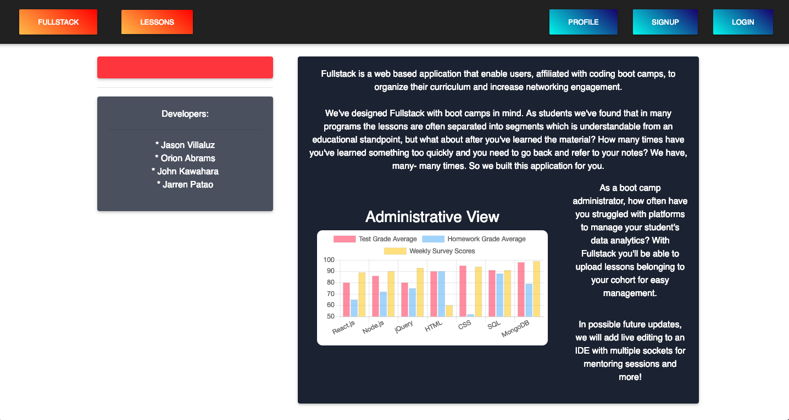
      * NavBar 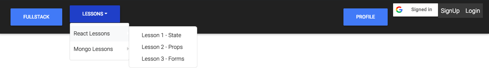
      * Sign up as a new user 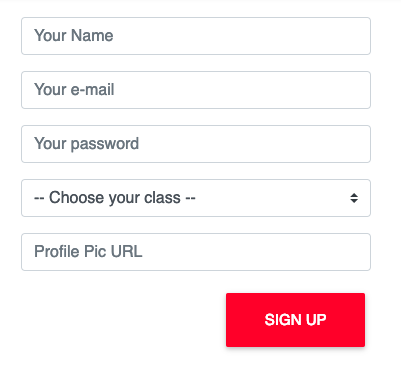
      * Login 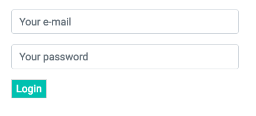
      * Lesson page 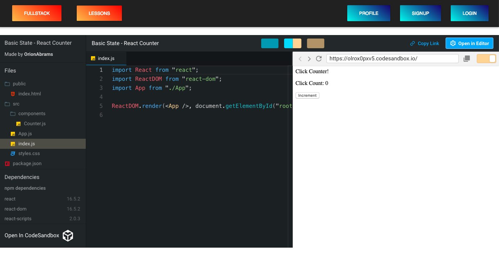
      * Student Profile page 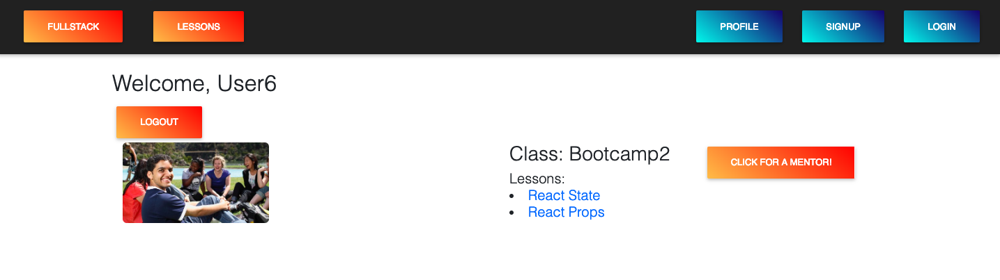
      * Student get mentor 
      * Admin Profile page 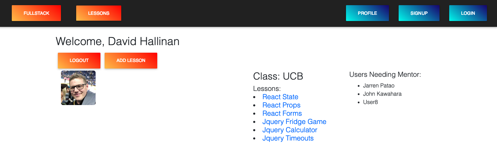
      * Add lesson 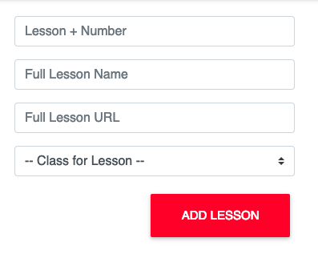
      * Charts 
      * Data Flow 
      * JSON Resources
        * Classes 
        * Lessons 
        * Users 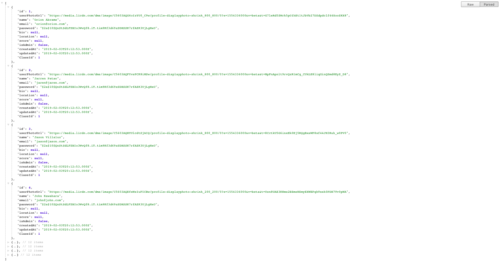
  * Design Description 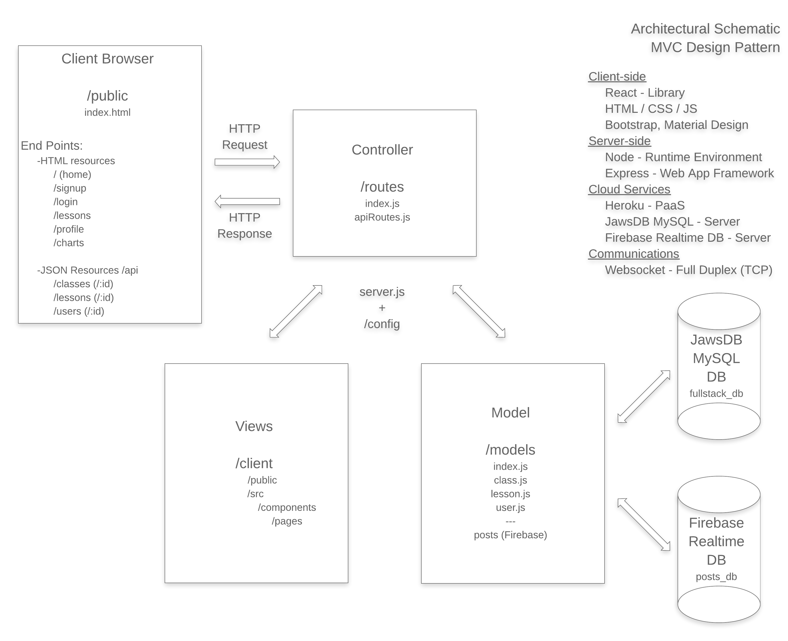
    * Application Setup (server.js)
      * Configure Express web app framework listening on process.env.PORT for Heroku deployment or default to 3001 for localhost. Serve up static assets. Configure middleware including Morgan Logger and parse URL encoded (any type including nested objects, JSON). Setup Passport authentication. Setup routes. Sync Sequelize models.
      * Required modules: npm (express, express-session, morgan), /routes, /models, /config/passport
      * Relevant functions: require(), use(), sync(), listen()
      * Export: N/A
    * Database Setup (schema.sql, seeds.sql)
      * Create fullstack_db database
      * Available Seed with classes, lessons and users
    * Configuration Definition (config.json)
      * Define configuration object with nested development, test and production environments
    * Model Setup (/models, index.js) 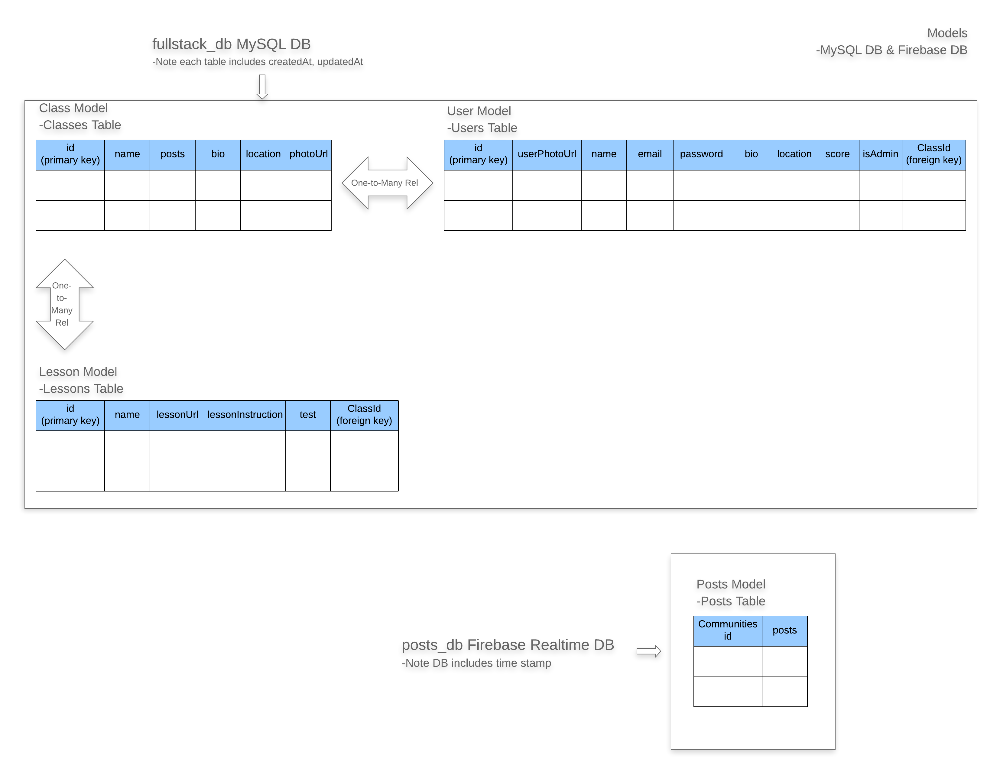
      * Define Sequelize models for Class, Lesson and User objects including associations
      * Configure connection to MySQL, including conditional to enable MySQL with Heroku deployment using JawsDB add-on or localhost, using Sequelize models.
      * Required modules: fs, path, Sequelize, config.json
      * Relevant functions: require(), readdirSync(), filter(), forEach(), import(), join(), keys(), associate(), exports(), define(), hasMany(), belongsTo()
      * Export: db, Class, Lesson, User
    * Posts Model Setup (TBD)
      * Define Firebase Realtime version of Posts object
    * Controller Setup (index.js, apiRoutes.js, authRoutes.js /controllers)
      * Assign routing views <-> model <-> DB as HTTP methods <-> CRUD operations <-> SQL
        * POST <-> Create <-> INSERT
        * GET <-> Read <-> SELECT
        * PUT <-> Update <-> UPDATE
        * DELETE <-> Delete <-> DELETE
      * Required modules: path, express, apiRoutes.js, passport.js, isAuthenticated.js, /controllers, /models
      * Relevant functions: require(), use(), sendFile(), exports(), route(), redirect(), get(), findAll(), findById(), findOne(), post(), create(), put(), update(), delete(), destroy(), then(), catch()
      * Export: router, findAll, findById, findOne, create, update, delete
    * Authentication Setup (passport.js, isAuthenticated.js)
      * Use Passport to configure authentication of user login
      * Required modules: passport, passport-local, /models
      * Relevant functions: require(), use(), findOne(), then(), serializeUser()
      * Export: passport
    * View Setup (/client, /public, /src/index, App.js)
      * Configure React library for single page application leveraging the following reusable components:
        * /components
          * ChartsPage
          * Footer
          * FormInput
          * NavTabs
        * /pages
          * AddLesson
          * Chart
          * ChartReg
          * Contact
          * Home
          * Lesson
          * Login
          * Logout
          * NoMatch
          * Profile
          * SignUp
  * Prerequisites for Development:
    * MacBook Air (Intel Core i7, 2.2 GHz, 1 Processor, 2 Cores, 8GB)
    * 64 bit operating system 
    * git version 2.18.0
    * Visual Studio Code Version 1.29.1
    * [GitHub Project-3](https://github.com/OrionAbrams/Project-3)
    * Chrome Version 70.0.3538.110 (Official Build) (64-bit)
  * Built With:
    * This app was bootstrapped with [Create React App](https://github.com/facebook/create-react-app).
    * Client-side:
      * HTML/CSS/JS
      * [Material Design for Bootstrap](https://fezvrasta.github.io/bootstrap-material-design/docs/4.0/getting-started/introduction/)
    * Server-side:
      * [Node.js](https://nodejs.org/docs/latest/api/documentation.html)
        * [npm](https://www.npmjs.com/)
          * Server-side:
            * [bcrypt-nodejs](https://www.npmjs.com/package/bcrypt-nodejs)
            * [dotenv](https://www.npmjs.com/package/dotenv)
            * [express](https://www.npmjs.com/package/express)
            * [express-session](https://www.npmjs.com/package/express-session)
            * [if-env](https://www.npmjs.com/package/if-env)
            * [morgan](https://www.npmjs.com/package/morgan)
            * [mysql2](https://www.npmjs.com/package/mysql2)
            * [passport](https://www.npmjs.com/package/passport)
            * [passport-local](https://www.npmjs.com/package/passport-local)
            * [sequelize](https://www.npmjs.com/package/sequelize)
          * Client-side:
            * [axios](https://www.npmjs.com/package/axios)
            * [mdbreact](https://www.npmjs.com/package/mdbreact)
            * [react](https://www.npmjs.com/package/react)
            * [react-dom](https://www.npmjs.com/package/react-dom)
            * [react-iframe](https://www.npmjs.com/package/react-iframe)
            * [react-router-dom](https://www.npmjs.com/package/react-router-dom)
            * [react-scripts](https://www.npmjs.com/package/react-scripts)
          
    * Cloud:
      * [Heroku](https://devcenter.heroku.com/articles/getting-started-with-nodejs) with [JawsDB MySQL plugin](https://devcenter.heroku.com/articles/jawsdb)
      * [Firebase Realtime DB](https://firebase.google.com/docs/web/setup)
    * Communications:
      * Websocket TBD
  * Installing:
    * For further development or use of this application, clone or download application files from GitHub, which is organized into the following directory structure:
      * /Project-3 (application root directory level for Node/Express server)
        * /client (React app specific directories)
          * /node_modules (ignored by git) - generated first time npm install executes
          * /public
            * /assets
              * /readmelinks
          * /src
            * /components
              * /pages
          * .env (ignored by git) - environmental variables with REACT_APP_ prefix
          * package-lock.json
          * package.json - includes scripts, dependencies, devDependencies
          * README.md
          * yarn.lock
        * /config
          * /middleware
        * /controllers
        * /models
        * /node_modules (ignored by git) - generated first time npm install executes
        * /routes
        * .env (ignored by git) - environmental variables for Node/Express server
        * .gitignore
        * LICENSE
        * package-lock.json
        * package.json - includes scripts, dependencies, devDependencies
        * README.md
        * server.js
        * yarn.lock
    * Once the application files are ready per the above structure, go to the application root directory level and enter the following in terminal:
      * yarn install
        * Installs required node packages, referring to the included dependencies in respective package.json files and creates required node packages in /node_modules and creates or updates the respective package-lock.json, yarn.lock files.
      * yarn start
        * Runs the app in development mode at http://localhost:3000 (React) and http://localhost:3001 (Node/Express).
  * Running the tests:
    * Unit testing was informally executed
  * Deployment:
    * App deployed on [Heroku](https://fullstack-network.herokuapp.com/)
 ## Versioning
  * For the versions available, see the tags on this repository.
 ## Authors
  * Orion Abrams, Jarren Patao, Jason Villaluz, John Kawahara.
  * N/A- See also the list of contributors who participated in this project.
 ## License
  * This project is licensed under the [MIT License](LICENSE).
 ## Acknowledgments
  * Thanks to David Hallinan, Hannah Bowers and Glo Austin for their guidance and support.
